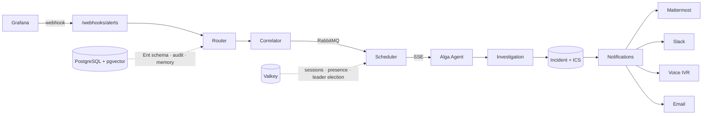

# Alga

> **Warning: Experimental Project**
>
> This project is experimental. Use at your own risk. Do not run in production unless you are fully aware of the implications. Monitor AI token usage closely when using autonomous investigation features.

[](https://go.dev/)
[](https://vuejs.org/)
[](LICENSE)
[](https://hub.docker.com/)

**The open-source, AI-powered incident management platform.**

Alga is a self-hosted incident management platform with an autonomous AI investigation agent built in. It ingests alerts from Grafana (or any webhook source), correlates related alerts, triages and investigates them autonomously, orchestrates the full incident response, and routes to the right responder with on-call schedules and escalation policies — so teams spend less time triaging noise and more time resolving what matters.

## Why Alga?

- **Incident management that flows** — Full lifecycle from detection through resolution with ICS roles, SLA tracking, and automated escalation
- **Deduplication that works** — Fingerprint-based dedup with partial unique indexes at the database level
- **Investigation that scales** — Horizontal scaling with Valkey-backed agent presence and leader election
- **On-call that fits your team** — Multi-layer schedules with follow-the-sun support, overrides, and handoffs
- **Security that's built-in** — Argon2id password hashing, AES-256-GCM envelope encryption, CSRF protection, ASVS Level 2 hardening, and constant-time comparisons
- **Knowledge that compounds** — Episodic memory, operator-curated notes, and pgvector-searched agent memories improve response over time

## Features

| Feature | Description |
| --- | --- |
| Alert Ingestion | Webhook-based ingestion from Grafana/Prometheus with fingerprint deduplication |
| Alert Correlation | Groups related alerts by deployment + alertname within configurable time windows |
| AI Investigation | Autonomous SRE agent pipeline with Hermes/OpenClaw and Alga Agent integration |
| LLM Triage | Rule-based + LLM-powered triage for automated classification and noise suppression |
| Playbooks | Structured response procedures matched to investigations via label selectors |
| Incident Management | Full lifecycle with ICS command structure, SLA tracking, and escalation |
| Post-Mortems | Post-incident reviews with action items and timeline reconstruction |
| Multi-Channel Routing | Route alerts to Mattermost, Slack, email, or voice with first-match rule evaluation |
| On-Call & Escalation | Multi-layer schedules with follow-the-sun support, overrides, and handoffs |
| Voice Escalation | Twilio and Telnyx voice-call IVR for critical alerts, with TTS provider selection |
| Service Catalog | Track service status, dependencies, priority-weighted scoring, and incident impact |
| Status Pages | Public/private status pages driven by incident and service state |
| Maintenance Windows | Time-boxed alert suppression with CRUD API and management UI |
| Team Collaboration | RBAC, shared knowledge base, agent memory, @mentions, and global search |
| SSO & Auth | Local auth, Google OAuth, Slack sign-in, and multi-provider OIDC SSO |
| Google Meet War Rooms | Auto-create a Meet space per incident for real-time coordination |
| Coordination & Handoff | Structured incident handoffs with acknowledgment and coordination streams |
| Heartbeats | Monitor expected-beat sources and alert on missed heartbeats |
| Agent DMs | Private 1:1 chat with the Alga agent alongside investigation threads |
| Shared Secrets & Credentials | Encrypted credential providers and shared secrets for integrations and tools |
| Personal Access Tokens | Scoped PATs for CLI and API access outside the browser session |
| Real-time Updates (SSE) | Live dashboard updates with Valkey pub/sub cross-replica fan-out |
| Agent Memory | pgvector-backed vector search for agent memory and experience |
| Data Retention | Configurable retention with `data prune` (dry-run supported) and cleanup |
| Monitoring | Prometheus-compatible `/metrics`, expvar, and Grafana dashboard |
| REST API | Full CRUD API for alerts, investigations, incidents, routes, integrations, and users |

## Quick Start

```bash
git clone https://github.com/hahnavi/alga.git && cd alga
./setup.sh
docker compose up -d
```

Open [http://localhost:3000](http://localhost:3000) and complete the setup wizard to create the initial admin account (email, password, and full name). The wizard is only available the first time, before any admin exists.

> **Contributors:** to build images from source instead of pulling from GHCR, use
> `docker compose -f docker-compose.yml -f docker-compose.dev.yml up -d --build`.

### Send a test alert

1. Create a webhook token from the dashboard under **Tokens** (or via `alga webhook-token generate`).
2. Send a test alert:

```bash
curl -X POST http://localhost:8080/webhooks/alerts \
  -H "Authorization: Bearer <your-token>" \
  -H "Content-Type: application/json" \
  -d '{
    "alerts": [{
      "status": "firing",
      "labels": {
        "alertname": "HighMemoryUsage",
        "severity": "warning",
        "namespace": "production"
      },
      "annotations": {
        "summary": "Memory usage above 90%"
      }
    }]
  }'
```

## Architecture



## Tech Stack

| Layer | Technology |
| --- | --- |
| Backend | Go 1.26, method-based `net/http` routing, Ent ORM, RabbitMQ, Valkey |
| Frontend | Vue 3.5 + TypeScript, Vite, Pinia, Tailwind CSS v4, TipTap, Chart.js |
| Database | PostgreSQL 18 with pgvector |
| Infra | Docker Compose, Caddy (HTTPS), Helm chart, Moonrepo build orchestration |

## Integrations

| Integration | Description |
| --- | --- |
| Agent SDKs | Go, JavaScript, Python, and Rust SDKs for the agent bearer API (`integrations/alga-agent-sdk-*`) |
| Hermes Plugin | Hermes AI investigation agent plugin for autonomous incident triage and response |
| OpenClaw Plugin | OpenClaw AI investigation agent plugin for autonomous incident triage and response |
| Mattermost Plugin | Bidirectional thread sync via shared-secret auth |
| Slack App | Events API integration with signing-secret verification |

## Configuration

Key environment variables (see `apps/backend/.env.example` for the full list):

| Variable | Description |
| --- | --- |
| `POSTGRES_DSN` | PostgreSQL connection string (use `sslmode=require` in production) |
| `ENCRYPTION_KEYS` | Comma-separated `kid:base64(32B)` keyring for AES-256-GCM envelope encryption |
| `SECRET_PEPPER` | Base64 HMAC pepper for password pre-hashing and token storage (required in all envs) |
| `VALKEY_ADDR` | Valkey/Redis address for sessions, caching, presence, and leader election |
| `RABBITMQ_URI` | RabbitMQ AMQP URI for async alert and investigation pipeline |
| `VOICE_PROVIDER` | Voice escalation provider: `twilio` (default) or `telnyx` |
| `SMTP_HOST` / `SMTP_*` | SMTP for password-reset and email notifications |
| `OIDC_*` / `GOOGLE_*` | OIDC SSO and Google OAuth / Meet configuration |
| `MEMORY_*` | Agent memory: embedding URL, LLM, similarity threshold, auto-extract |

## Documentation

Full documentation is available at the [Alga docs site](https://algaops.my.id) or in the [`docs/`](docs/) directory:

- [Getting Started](docs/getting-started/) — Quick start, installation, onboarding
- [Core Features](docs/core-features/) — Alerts, routing, investigation, triage, knowledge base
- [Incident Management](docs/incident-management/) — Lifecycle, SLA tracking, post-mortems
- [Service Management](docs/service-management/) — Service catalog, dependencies, status pages
- [On-Call & Escalation](docs/on-call/) — Teams, schedules, escalation policies, handoffs
- [Integrations](docs/integrations/) — Slack, Mattermost, Twilio/Telnyx, email
- [Configuration](docs/configuration/) — Environment variables, security, system config
- [Operations](docs/operations/) — Architecture, deployment, monitoring, CLI, backup
- [API Reference](docs/api-reference/) — REST API overview

## Contributing

See [CONTRIBUTING.md](CONTRIBUTING.md) for development setup and PR guidelines.

## License

[MIT](LICENSE)
